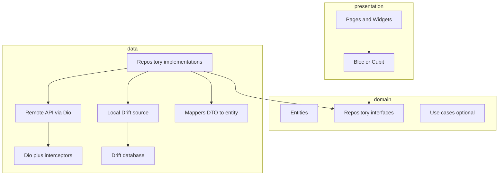

# Power Banker — Architecture and delivery plan

## Context note

The [shared ChatGPT link](https://chatgpt.com/share/69bd3eea-0f40-800b-91ce-4089659cb609) is not available as readable app requirements from here (only a generic page shell). This plan assumes a **personal finance** app: **monitoring** (balances, summaries, trends) plus a **transactions** area with **dashboard-style visualization** (charts, filters, time ranges). You can map your exact entities from the chat onto the domain layer below without changing the overall structure.

## Target architecture (clean layers)

**Dependency rule:** `presentation` → `domain` ← `data`. Domain has **no** Flutter imports.

Suggested layout under `[lib/](lib/)`:

| Layer            | Suggested paths                                                                                                                                                     |
| ---------------- | ------------------------------------------------------------------------------------------------------------------------------------------------------------------- |
| **domain**       | `lib/domain/entities/`, `lib/domain/repositories/` (interfaces), optional `lib/domain/usecases/`                                                                    |
| **data**         | `lib/data/models/` (DB rows / API DTOs), `lib/data/datasources/local/` (Drift), `lib/data/datasources/remote/` (Dio), `lib/data/repositories/`, `lib/data/mappers/` |
| **presentation** | `lib/presentation/router/`, `lib/presentation/bloc/` (feature folders), `lib/presentation/pages/`, `lib/presentation/widgets/`                                      |
| **core**         | `lib/core/network/` (Dio + interceptors), `lib/core/di/`, `lib/core/theme/`, `lib/core/utils/`                                                                      |

**Entities (examples to align with your chat):** `Account`, `Transaction`, `Category`, `Money` (amount + currency code), optional `Budget` / `Tag`. Keep entities immutable and validation rules in domain where it matters.

---

## State management: Bloc + streams

- **Packages:** `flutter_bloc`, `bloc`, and `equatable` (or `freezed` later for unions/sealed states).
- **Pattern:** Repositories expose **async** APIs and/or `**Stream<List<...>>` / `Stream
`** when data should react to DB changes (e.g. after insert/update). Data layer subscribes to Drift’s **watch** queries and maps rows to domain entities.
- **Bloc:** Each feature bloc/cubit calls repository methods and/or `**await`s first load** and `**listen`s to streams** in `emit`/`on` handlers. Use `bloc_concurrency` (`restartable` / `droppable`) for search/filter events if needed.
- **Why streams:** Local DB updates (new transaction, edit) automatically refresh lists and dashboard aggregates without manual cache invalidation.

---

## Networking: Dio and interceptors

- **Package:** `[dio](https://pub.dev/packages/dio)`.
- **Placement:** Instantiate **one** `Dio` in DI/bootstrap (e.g. `lib/core/network/dio_client.dart` or `app_http_client.dart`) with `BaseOptions` (base URL, timeouts, content type). Repositories or dedicated **remote data sources** call `dio.get/post/...`; they do not construct ad-hoc `Dio` per request.
- **Interceptors (typical stack, outer to inner):**
  - **Logging** — `LogInterceptor` in debug only (or a thin custom logger).
  - **Auth** — inject tokens from secure storage / session into `RequestOptions.headers` (when you add auth).
  - **Error** — map `DioException` to domain failures (`NetworkFailure`, `ServerFailure`) in one place for blocs to handle consistently.
  - Optional: **retry** for idempotent GETs, **PrettyDioLogger**-style dev tooling.
- **Clean architecture:** Remote DTOs live in `data/models/`; map to domain entities in mappers. Domain stays free of Dio types.
- **Sync with Drift:** When you pull from API, remote data sources return DTOs; repository impl **persists** via Drift (upsert) then exposes `**watch`** from local DB so UI stays stream-driven and offline-friendly.

---

## Routing: `go_router`

- **Package:** `go_router`.
- **Root:** `MaterialApp.router` in `[lib/main.dart](lib/main.dart)` with a single `GoRouter` (and optional `refreshListenable` if auth is added later).
- **Structure:** Named routes for deep links; use `**ShellRoute`** if you add a persistent scaffold (e.g. bottom navigation: Dashboard | Transactions | Settings).
- **Bloc access:** Provide repositories/blocs **above** `MaterialApp.router` (`MultiRepositoryProvider` / `MultiBlocProvider`) or use a small DI container (see below) and pass into `GoRouter`’s `builder` context.

---

## Animations

- **Route transitions:** `CustomTransitionPage` (or `NoTransitionPage` where appropriate) in `GoRouter` routes for **fade/slide** between main sections.
- **In-screen:** `AnimatedSwitcher` for tab-like content; `ImplicitlyAnimatedWidget`s for KPI cards; **Hero** between list → detail if you add transaction detail.
- **Charts:** Prefer animating chart builds after first frame (`AnimationController` only where needed) to avoid jank; keep heavy work off the UI isolate.

---

## Local persistence: Drift only

- **Choice:** **[Drift](https://pub.dev/packages/drift)** (SQLite) — single source of truth on device. Use **code generation** for typed queries, **migrations**, and `**watch`** streams for relational finance data (transactions, accounts, categories).
- **Bootstrap:** Open the database in `main()` (or `bootstrap()` before `runApp`), run migrations, then inject `AppDatabase` and repositories. No parallel local store (Hive/Isar) unless a future requirement explicitly needs it.

---

## Dependency injection

- **Lightweight:** `provider` + `RepositoryProvider` at the app root.
- **Scalable:** `get_it` + `injectable` (optional) to register DB, repositories, and blocs once; tests override with mocks.

---

## Testing strategy

| Layer           | Focus                                                                                        | Tools                                           |
| --------------- | -------------------------------------------------------------------------------------------- | ----------------------------------------------- |
| **Unit**        | Entities (equality), mappers, use cases, repository logic with **fake/mocked** local source  | `test/`, `mocktail`                             |
| **Widget**      | Screens with **mock blocs** (`MockBloc` or `bloc_test`), golden tests optional               | `flutter_test`, `bloc_test`, `mocktail`         |
| **Integration** | Full flow: launch app, navigate with `go_router` test helpers, add transaction, assert UI/DB | `integration_test` package, `integration_test/` |

- **Bloc tests:** `blocTest` from `bloc_test` for event → state sequences; mock repositories returning fixed futures/streams.
- **Integration:** One `integration_test/app_test.dart` (or per-flow) driving real Drift DB in a temp file or in-memory (`NativeDatabase.memory()` for Drift in tests).

---

## Implementation phases (practical order)

1. **Foundation:** Add dependencies to `[pubspec.yaml](pubspec.yaml)`; create folder structure; `main` → bootstrap DB + DI; replace `MaterialApp` with `MaterialApp.router`.
2. **Domain + data:** Define 2–3 core entities and repository interfaces; implement Drift tables + DAO + repository impl with mappers; prove `**watchTransactions`** (or similar) works.
3. **Presentation:** First feature (e.g. transaction list + add form) with Cubit/Bloc consuming repository; wire routes in `go_router`.
4. **Dashboard:** Read-only aggregates (sums by period/category) via repository methods or streams; chart widget(s) in presentation only.
5. **Animations + polish:** Shell route transitions and list/detail animations.
6. **Tests:** Unit tests for repositories/mappers; widget tests for one screen; one integration test for “add transaction and see it listed.”

---

## Key files to introduce (new)

- `[lib/main.dart](lib/main.dart)` — bootstrap, `runApp` with providers/router only (no demo counter).
- `lib/presentation/router/app_router.dart` — `GoRouter` configuration.
- `lib/data/datasources/local/app_database.dart` — Drift database (generated `*.g.dart` alongside).
- `lib/domain/repositories/transaction_repository.dart` — abstract contract.
- `lib/data/repositories/transaction_repository_impl.dart` — implementation.
- `test/` — mirror structure under `domain`, `data`, `presentation`.
- `integration_test/` — driver + at least one E2E scenario.

---

## Dependencies to add (concise)

- **App:** `flutter_bloc`, `equatable`, `go_router`, `drift`, `sqlite3_flutter_libs` (mobile/desktop), `path_provider`, `path`
- **Dev:** `drift_dev`, `build_runner`, `bloc_test`, `mocktail`, `integration_test` (SDK)

(Version pins should follow `flutter pub add` at implementation time.)

---

## Risks / decisions to confirm later

- **Exact feature set** from your ChatGPT thread (e.g. multi-currency, recurring transactions, imports): affects entities and DB schema only; layers stay the same.
- **Persistence choice:** Drift vs Isar changes codegen and test setup slightly; domain stays unchanged if interfaces are stable.

